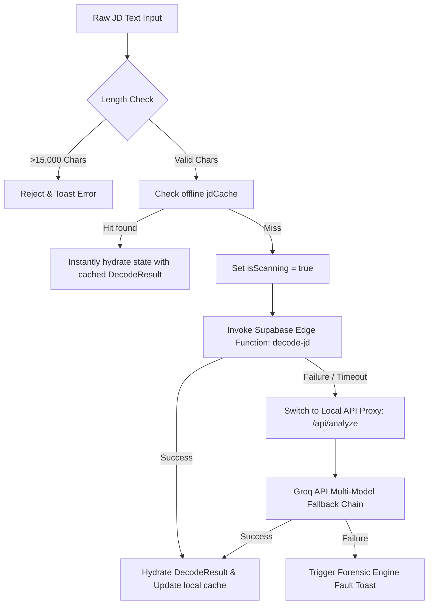
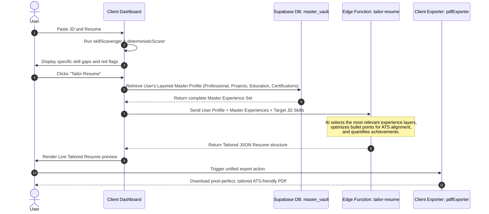

# Lumina AI Career Engine — Technical Architecture Manual

This document details the complete system architecture, folder layouts, core technical mechanisms, data-flow pipelines, and coding standards for the **Lumina AI Career Engine** workspace.

---

## 1. Tech Stack & Dependencies

### Core Frontend Framework
- **React (v18.3.1) & TypeScript**: Modern component library architecture with strong type safety.
- **Vite (v5.4)**: Ultra-fast bundler and development server, utilizing `@vitejs/plugin-react-swc` for fast compiler performance using Rust-based SWC.
- **React Router DOM (v6.30)**: Orchestrates client-side routing, protected dashboards, and fallback navigation paths.

### Styling & Aesthetics
- **Tailwind CSS (v3.4)**: Atomic CSS design tokens.
- **CSS Variables & Custom Tokens**: Mapped inside `@layer base` in `src/index.css` for a custom brand system (Pure White background, Lumina Navy `#1E2A3A`, Lumina Teal `#10B981`, Signal Blue `#2563EB`, Market Amber `#F59E0B`, Risk/Gap Red `#EF4444`).
- **Framer Motion (v12)**: Handles high-fidelity animations, entering/exiting panel transitions, dashboard loading sequences, and bento-card spring micro-interactions.
- **GSAP & @gsap/react (v3)**: Drives complex 3D-like, multi-phase landing page micro-animations and scrolling transitions (e.g., in `JourneyScene.tsx`, `Road.tsx`).
- **Lucide React (v0.462)**: Premium outline icon system.
- **Vanilla Tilt (v1.8)**: Implements responsive 3D card tilt effects on landing page components.

### 3D Graphics & Canvas Engines
- **Three.js & React Three Fiber (R3F) & @react-three/drei**: Powering the advanced 3D visual landscape, interactive roadmaps, city light models, and particles of the landing experience.
- **React Spring (@react-spring/three)**: Spring-physics interpolation in 3D views.
- **@tsparticles/react & @tsparticles/slim**: Render dynamic interactive background particles.

### Core Utilities & Libraries
- **Supabase JS client (@supabase/supabase-js)**: Integrates the frontend client directly with user authentication, RLS-protected database operations, and Supabase Edge Functions.
- **TanStack React Query (@tanstack/react-query v5)**: Standardizes caching, automatic invalidation, and request synchronization of server states.
- **React Hook Form & Zod**: Schema-driven validation and state control for complex forms (such as in `Auth.tsx` and the `MasterVault`).
- **PDF & Document Parsing/Exporting Utilities**:
  - `pdfjs-dist`: High-performance PDF parsing in client environments.
  - `mammoth`: DOCX parser for extracting resumes inside the browser.
  - `jspdf`: Programmatic PDF rendering, formatting, and downloads.
  - `html2canvas`: High-fidelity client-side HTML layout rendering to pixel-perfect image representations.

### Backend Infrastructure
- **Supabase Edge Functions**: Deno-based, low-latency API handlers orchestrating parsing, resume-tailoring, and bullet generation.
- **Vercel Serverless Functions (`/api/analyze.ts`)**: Secure Node.js middleware mapping Groq API requests, securing `GROQ_API_KEY`, and deploying a multi-model fallback chain (`llama-3.3-70b-versatile`, `gemma2-9b-it`, etc.) to guard against rate-limiting failures.

---

## 2. Folder Structure

```
lumina-jd-scanner-main/
├── .github/                       # GitHub workflow and CI/CD settings
├── .husky/                         # Git hooks (Lint-staged, Pre-commit)
├── api/                            # Vercel Serverless Endpoints
│   └── analyze.ts                  # Secure Groq AI fallback proxy
├── app/                            # [UNUSED NEXT.JS ARTIFACTS]
│   ├── layout.tsx                  # Kept for deployment compatibility/relic
│   ├── page.tsx                    
│   └── sitemap.ts                  
├── audit_assets/                   # Performance audit assets
├── components/                     # [UNUSED] Empty root component placeholders
├── dist/                           # Compiled production build directory
├── lib/                            # [UNUSED] Empty root library placeholders
├── public/                         # Static assets (Favicon, sitemap.xml, robots.txt)
├── src/                            # Operational Client Source Code
│   ├── App.css                     # App global layout styles
│   ├── App.tsx                     # React Router, Theme, Context and App wrapper
│   ├── index.css                   # Global Tailwind CSS definitions & Custom Brand Tokens
│   ├── main.tsx                    # DOM rendering mount point
│   ├── components/                 # Core React Component Library
│   │   ├── dashboard/              # Dashboard components (History, Skeletons, Widgets)
│   │   ├── gap-analysis/           # Resume analysis, simulators, and matching views
│   │   ├── jd-decoder/             # Job description decoders and loading screens
│   │   ├── landing/                # High-fidelity landing modules and 3D scenes
│   │   ├── market-insights/        # Competitiveness and market metrics components
│   │   ├── onboarding/             # Onboarding tutorials, tours, and welcome states
│   │   ├── resume-tailor/          # Resume generators, enhancers, and builders
│   │   ├── ui/                     # Reusable Shadcn base UI components (Button, Form, Sonner...)
│   │   └── *                       # Shared components (GlobalNavbar, ScannerView, MasterVault)
│   ├── context/                    # React Context stores
│   │   ├── SessionContext.tsx      # Pre-auth anonymous browser sessions
│   │   └── ToastContext.tsx        # Application global alerts
│   ├── data/                       # Static mock and domain datasets
│   ├── hooks/                      # Custom React Hooks
│   │   ├── useAuth.ts              # Session controls mapping Supabase Auth
│   │   ├── useDecodeJD.ts          # Core hook calling the JD AI pipeline
│   │   └── useApplications.ts      # Active application tracking
│   ├── integrations/               # API integration client setups
│   │   ├── lovable/                # Integration adapters
│   │   └── supabase/               # Supabase JS clients and types
│   ├── lib/                        # Common utility libraries
│   │   ├── deterministicScorer.ts  # STRICT, OFFLINE, DETERMINISTIC matching algorithm
│   │   ├── skillScavenger.ts       # Text parsing skill scavenger heuristics
│   │   ├── pdfExporter.ts          # Unified report PDF generation engine
│   │   ├── jdCache.ts              # Offline local storage JD cache manager
│   │   └── *                       # GSAP, shortcuts, session storage, error handlers
│   ├── pages/                      # Client Pages (React Router Element Mappings)
│   │   ├── Index.tsx               # Root production landing page
│   │   ├── Auth.tsx                # Universal authentication portal
│   │   ├── Dashboard.tsx           # Main workspace dashboard orchestrator
│   │   └── NotFound.tsx            # Fallback router error screen
│   ├── styles/                     # CSS Modules & design token mappings
│   ├── test/                       # Vitest execution files
│   └── types/                      # TypeScript definitions (jd.ts, tabs.ts)
├── supabase/                       # Supabase Local Settings
│   ├── config.toml                 
│   ├── functions/                  # Deno Edge Functions
│   │   ├── decode-jd/              # Extracts structured parameters from raw JD text
│   │   ├── compare-resume/         # Validates resume gaps
│   │   ├── tailor-resume/          # Combines experiences and custom structures
│   │   └── *                       
│   └── migrations/                 # PostgreSQL structural migration schemas
│       ├── 20240419_generated_resumes.sql
│       ├── 20260327044335_profiles.sql
│       └── 20260414_master_vault.sql
├── tailwind.config.ts              # Custom CSS rules mapping the premium brand token system
├── tsconfig.json                   # Base TypeScript config mapping `@/*` to `src/*`
└── vite.config.ts                  # Bundler mapping aliases, R3F optimizers, and ports
```

---

## 3. Core Architecture & Data Flow

### 3.1. Job Description Forensic Extraction
When a user inputs raw JD text in the `ScannerView`, the data undergoes the following routing sequence:



### 3.2. Offline Deterministic Resume Matching
To guarantee stable, verifiable, and instant feedback without database roundtrips, the matching engine (`src/lib/deterministicScorer.ts`) is designed to be **100% deterministic and runs entirely client-side**.

#### Heuristics of the Deterministic Scorer:
1. **Text Normalization**: Strips casing, standardizes smart quotes/hyphens, clears bracketed markers, and cleans whitespaces.
2. **Word-Boundary Matching**: Rejects partial false-positive substrings (e.g., matching `"AI"` will trigger on `"work with AI tools"` but never on `"plain"` or `"email"`).
3. **Advanced Skill Expansion**:
   - **Slash Alternatives**: Parses `"AWS / GCP"` or `"Python/TypeScript"` to check each option separately, while skipping standard compound terms like `"CI/CD"` or `"UI/UX"`.
   - **Parenthetical Alternatives**: Translates `"RAG (Retrieval Augmented Generation)"` into a primary term `"RAG"` and nested alternatives `["Retrieval Augmented Generation"]`. Commas inside brackets like `"LLMs (OpenAI, Anthropic, Llama)"` are converted to array items.
   - **Synonym Expansion**: Applies canonical terms from a local lookup table (e.g., mapping `"js"` and `"ecmascript"` to `"javascript"`).
4. **Weighted Scopes**: Computes an aggregate score out of 100 based on the scavenged skill weight (based on importance attributes). Missing or partial items trigger mathematically scaled score deductions.

### 3.3. The Three-Layer Resume Optimization Pipeline
Lumina implements an elite personalization mechanism that tailors resumes using structural alignment:



---

## 4. Coding Conventions & Architectural Guidelines

To maintain visual excellence, performance, and structure, all developers must adhere to these patterns:

### 4.1. Visual & Styling Standards (Vercel-Vite Standard)
- **Fluid Layout Tokens**: Use native variables (`var(--primary)`, `var(--secondary)`, etc.) instead of hardcoded hex values to support global theme changes.
- **Glassmorphism & Texture**: Wrap dashboard groups in `.premium-card`, `.glass-panel`, or `.bento-card` classes. Use `.bg-noise` overlays and `.mesh-bg` gradients to preserve the modern visual standard.
- **Tailwind Restrictions**: Do not build unorganized utility classes. Group Tailwind directives inside CSS components using `@apply` if they are repeated more than three times.
- **No Placeholders**: Never use mock icons or grey layout boxes. Generate high-fidelity custom SVGs or apply the visual asset generator.

### 4.2. State Management & Data Fetching
- **Server States**: Use **React Query** (`useQuery`, `useMutation`) for database entities (such as profiles, user applications, and generated resume vaults). Do not store server-fetched data in global React states.
- **Local Persistence States**: Keep operational JD records, scan history, and active session identifiers synchronized with `localStorage` utilizing wrapper methods in `src/lib/sessionStorage.ts` and `src/lib/jdCache.ts`.

### 4.3. Database Integrity & Row Level Security (RLS)
- **RLS Enforcement**: Every table under the `public` schema **MUST** enable RLS and specify explicit security policies.
- **User Segregation**: Enforce user segregation by matching against the user token identifier:
  ```sql
  CREATE POLICY "Users can manage their own records"
      ON public.target_table FOR ALL
      TO authenticated
      USING (auth.uid() = user_id)
      WITH CHECK (auth.uid() = user_id);
  ```
- **Automated Timestamps**: Hook the custom trigger function `update_updated_at_column()` to the table definition to ensure `updated_at` timestamps are updated correctly on modifications.

---

## 5. AI Agent Rules (Instructions for Future LLM Agents)

> [!IMPORTANT]
> If you are an AI coding agent working on this repository, you **MUST** strictly follow the guidelines below to prevent system degradation, build crashes, or styling regressions.

### Rule 1: No Circular Dependencies (Lazy Load Pages)
- **Issue**: Standard static page routing triggers circular dependency crashes on Vite builds.
- **Rule**: All page structures in `src/App.tsx` and main tab panels in `src/pages/Dashboard.tsx` **MUST** be loaded dynamically using `React.lazy()` and wrapped in `<Suspense fallback={...}>`.

### Rule 2: Respect the Offline Deterministic Scorer
- **Issue**: Modifying matching rules can lead to score drift, rendering user resumes inconsistent.
- **Rule**: Never convert the matching scoring code in `src/lib/deterministicScorer.ts` to call external AI models. All match evaluations must remain pure, side-effect-free, offline functions. Keep the synonyms dictionary updated here as new technologies emerge.

### Rule 3: Do Not Touch Unused Root Assets
- **Issue**: Empty folders `components` and `lib` at the root, along with the `app` folder, might look like clutter.
- **Rule**: Do not delete these structures. They represent relics kept to preserve local system compatibility and Vercel sitemap deployment protocols. All active frontend source code runs strictly inside the `src` folder.

### Rule 4: Edge Function & API Fallback Pattern
- **Issue**: External AI models can experience rate-limiting (status `429`) or network timeouts.
- **Rule**: When adding or editing dashboard components that request AI analysis:
  1. Primary call should route to a Supabase Deno Edge Function.
  2. Implement an immediate, secure fallback wrapper pointing to the `/api/analyze` proxy handler.
  3. Load the target prompts securely, keeping keys sanitized on client views.

### Rule 5: Keep Comments and Types Updated
- **Issue**: Untyped structures cause compiler issues on the automated Vercel test suite.
- **Rule**: Always compile and check code with `tsc --noEmit` before proposing modifications. All JSON models returned from Edge Functions must have explicit TypeScript interface mapping inside `src/types/jd.ts`. Do not use `any` unless absolutely necessary (for instance, in third-party library adapters).
