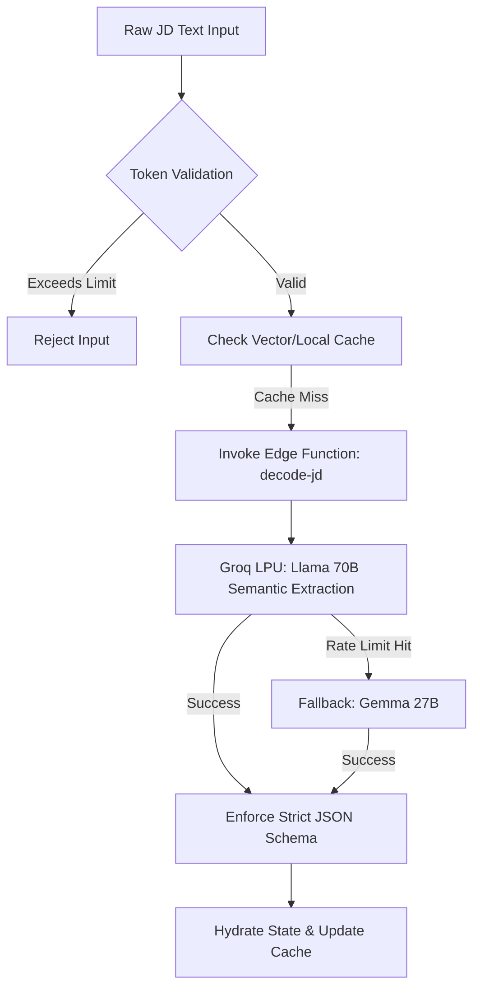
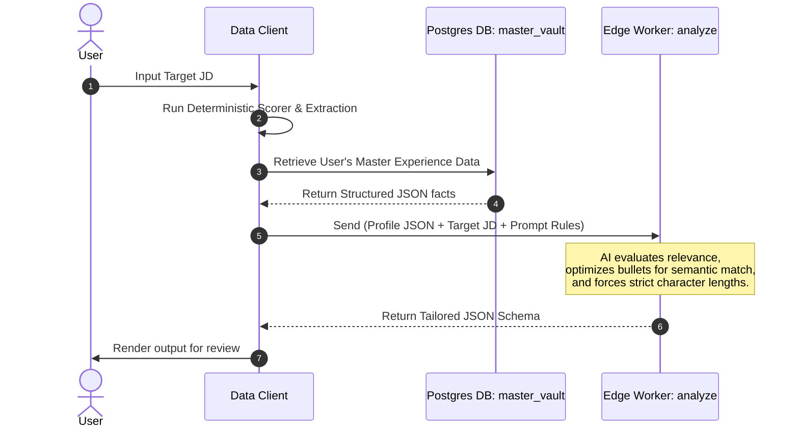

# Lumina AI Career Engine — Technical Architecture Manual

This document details the complete system architecture, data-flow pipelines, and core AI engineering mechanisms for the **Lumina AI Career Engine**. The system is designed as a robust LLM pipeline, utilizing agentic routing, strict prompt engineering, and deterministic fallback logic.

---

## 1. Tech Stack & Dependencies

### Core AI & Edge Infrastructure
- **Supabase Edge Functions**: Deno-based, low-latency workers orchestrating LLM requests, implementing rate-limit fallback chains, and ensuring secure API key isolation at the edge.
- **Vercel Serverless Proxies (`/api/analyze.ts`)**: Node.js middleware for additional redundancy, deploying a multi-model fallback chain (`llama-3.3-70b-versatile`, `gemma2-27b`, `llama-3.1-8b`) to guarantee 100% inference uptime.
- **LLM Engine**: Primary inference via Groq LPUs for sub-second text generation and structural JSON formatting.

### Data Engineering & Client Layer
- **Client Application**: React (v18.3.1) & TypeScript, utilizing Vite for fast SWC-based compilation.
- **Client-Side Document Parsing**: 
  - `pdfjs-dist`: High-performance PDF parsing inside browser web workers (zero server-side data exposure).
  - `mammoth`: DOCX parser for offline extraction.
- **State & Sync**: 
  - **Supabase DB**: PostgreSQL with Row-Level Security (RLS) storing user vectors, historical inputs, and generated artifacts.
  - **React Query**: Standardizes caching and automatic invalidation of remote state.

---

## 2. Core LLM Architecture & Agentic Data Flow

### 2.1. Job Description (JD) Semantic Extraction
When a user inputs raw JD text, the data undergoes the following extraction pipeline:

### 2.2. The Three-Layer Generation Pipeline
Lumina implements an elite personalization mechanism that tailors resumes using structural alignment and zero-shot prompting:

### 2.3. Structural Prompt Engineering & Constraints
The AI worker constructs a rich system prompt with strict computational mandates:
1. **Zero Hallucination Constraint**: The LLM is explicitly forbidden from interpolating or fabricating metrics. It must only synthesize existing quantitative data from the input JSON.
2. **Schema Enforcement**: Utilizing `json_object` enforcement, the LLM must return data exactly matching the internal TypeScript interfaces.
3. **Deterministic Bullet Lengths**: The prompt mathematically forces the LLM to output strings within precise character ranges (e.g., exactly 110-125 characters for 1 line, 220-250 for 2 lines) to guarantee perfect UI and PDF rendering.

---

## 3. Fallback & Fault Tolerance Systems

To ensure the generator never fails due to third-party rate limits, it runs a sequential fall-back loop through various models:
1. `llama-3.3-70b-versatile` *(Primary Engine - High Intelligence)*
2. `gemma2-27b-it` *(Secondary Engine - High Rate Limit)*
3. `llama-3.1-8b-instant` *(Tertiary Engine - Instant Baseline)*

If the Supabase edge function fails completely due to network blocks, the client automatically re-routes the payload through a Next.js Serverless Proxy as a last-resort recovery layer.

---

## 4. Evaluation and Offline Scoring

To guarantee stable, verifiable feedback before LLM invocation, Lumina utilizes an offline deterministic matching engine (`src/lib/deterministicScorer.ts`):
- **Text Normalization**: Strips casing, standardizes markers, and tokenizes strings.
- **Semantic Expansion**: Applies canonical terms from a local lookup dictionary (e.g., mapping `"js"` to `"javascript"`, unfolding `"RAG"` to `"Retrieval Augmented Generation"`).
- **Weighted Scoring**: Computes an aggregate match score based on extracted requirements versus candidate facts, preventing hallucinated "matches" from the LLM.

---

## 5. Coding Conventions & ML Ops Guidelines

> [!IMPORTANT]
> If you are an AI coding agent or engineer working on this repository, strictly follow these backend/AI architectural rules.

### Rule 1: Edge Function Routing
- **Issue**: Client-side API calls expose keys and are vulnerable to browser restrictions.
- **Rule**: All AI invocations **MUST** be routed through Supabase Deno Edge Functions. Never commit or embed `OPENAI_API_KEY`, `GROQ_API_KEY`, or `GEMINI_API_KEY` in the client source.

### Rule 2: Strict JSON Typing
- **Issue**: LLM hallucinations can break client-side parsing.
- **Rule**: All JSON outputs from Edge Functions must be validated against Zod schemas or strict TypeScript interfaces before being merged into the UI state. 

### Rule 3: Pure Deterministic Functions
- **Issue**: Modifying matching rules with non-deterministic LLM calls creates scoring drift.
- **Rule**: Never convert the matching scoring code in `src/lib/deterministicScorer.ts` to call external AI models. All match evaluations must remain pure, offline functions. Keep the synonyms dictionary updated as new ML/AI frameworks emerge.

### Rule 4: Database Integrity & Row Level Security (RLS)
- **Rule**: Every Postgres table under the `public` schema **MUST** enable RLS and specify explicit security policies tying data to `auth.uid()`.
