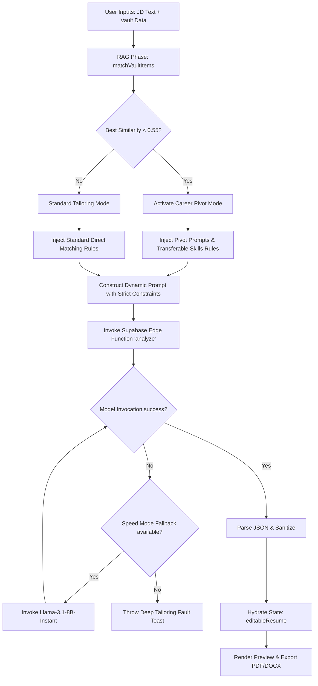

# Lumina AI: Resume Generation & Tailoring Pipeline Architecture

This document details the end-to-end technical architecture and execution flow of Lumina's **Candidacy Synthesizer (Resume Generator)** engine. It explains how raw profile data is transformed into a high-fidelity, ATS-hardened resume tailored to any target Job Description (JD).

---

## ── OVERALL PIPELINE WORKFLOW ──

---

## 1. Input Processing & Parameters Calibration
The pipeline begins by fetching the user's **Master Vault** items and matching them against the target Job Description (JD) and customization settings defined by the user:
*   **Target JD Context**: Target title, company name, and list of decoded skills (with importance ratings).
*   **Tactical Parameters**:
    *   *Typography Scale*: Font sizes for Name, Headlines, Sub-Headers, and Body text.
    *   *Global Font*: (e.g. Inter, Roboto, Merriweather, Arial, Times New Roman).
    *   *Summary Density*: Number of sentences (1 to 5).
    *   *Bullet Counts*: Number of bullets per Experience, Project, and Product item.
    *   *Spacing & Margins*: Line spacing ratio and narrow (1cm) vs. standard (2cm) page margins.
    *   *Tailoring Engine Mode*: **Quality** (Llama-3.3-70B) or **Speed** (Llama-3.1-8B).

---

## 2. RAG Phase (Semantic Vault Matching & Career Pivot Detection)
To prevent LLM hallucination and ground the tailoring process strictly in the candidate's actual history, Lumina runs a Retrieval-Augmented Generation (RAG) phase:
1.  **JD Query Embedding**: Generates a semantic query combining the target title, company, and high-importance skills.
2.  **Semantic Match**: Invokes the `matchVaultItems` function (filtering by `user_id` with a base similarity threshold of `0.40`, returning up to 10 matching vault items).
3.  **Career Pivot Detection**:
    *   Calculates the average and maximum similarity scores of the top matched items.
    *   If the highest similarity score is **$< 0.55$** (or no matches are returned), **Career Pivot Mode** is triggered.
4.  **Pivot Directives**: If a pivot is detected, the pipeline appends career-pivot prompts to the LLM instructions, enforcing:
    *   *Transferable Skills Emphasis*: Highlighting communication, system design, or leadership attributes that bridge domain gaps.
    *   *Adjacent Tech Mapping*: Bridging technology disparities (e.g., mapping React experience to Angular expectations under "component-based frontend architecture").
    *   *Summary Reframing*: Shaping the professional summary to present the pivot as intentional growth and a strength.
5.  **Context Filtering**: Filters the experience, project, and product items fed into the LLM prompt to only include RAG-matched IDs. This strips away noisy, unrelated background details and keeps the context window focused.

---

## 3. Dynamic Prompt Engineering
A detailed, instructions-dense prompt is constructed dynamically. Key prompt constraints include:
*   **Strict Sentence Counting**: Professional summary must contain exactly the number of sentences specified, where each sentence has a distinct purpose (Role + Level $\rightarrow$ Core Skills matching JD $\rightarrow$ Metrics/Impact $\rightarrow$ Career Ambition).
*   **Keywords Injection**: Mandates incorporating exact high-priority keywords from the target JD.
*   **Zero-Hallucination Guardrails**:
    *   Prohibits fabricating dates, degrees, companies, or seniorities.
    *   Restricts skills to only those present in the user's Master Vault.
    *   Prevents inventing entire domains (e.g., adding Healthcare metrics if the vault has no Healthcare entries).
*   **Forbidden Buzzwords**: Banishes weak verbs and passive styling (e.g. *"Utilizing/Utilized"*, *"Collaborating"*, *"Applying/Applied"*, *"Ensuring"*).
*   **Skills Section Format**: Enforces a strict `"Category Name: Skill 1, Skill 2"` format. (Omitting this colon crashes the parser).

---

## 4. Execution & Fallback Engine
Lumina delegates inference directly to Supabase Edge Functions (`analyze` endpoint) connected to high-performance LLM engines:
*   **Quality Mode**: Runs exclusively on `llama-3.3-70b-versatile` with a temperature of `0.3` for high precision.
*   **Speed Mode**:
    1.  Attempts invocation first on `llama-3.3-70b-versatile` (temp `0.5`).
    2.  If the request fails, times out (55-second client-side limit), or hits a `429` rate limit, it falls back to `llama-3.1-8b-instant`.
*   **Max Tokens**: Sets a token budget of `4000` to prevent truncation of resumes containing extensive experience lists.

---

## 5. Parsing & Sanitization
*   **JSON Extraction**: Locates the boundaries of the JSON block (first `{` and last `}`) in the LLM's response.
*   **Sanitization**: Runs `sanitizeGeneratedResume` to:
    *   Strip out any remaining markdown wrappers or comments.
    *   Ensure array fields (bullets, skills) exist and are properly structured.
    *   Format metrics in bold tags (`**`) as expected.

---

## 6. Live Rendering & Document Export
Once parsed and saved to the database:
1.  **Manual Editor Sync**: Loads the tailored JSON fields into the left-hand column accordion sections, allowing the user to override or add details.
2.  **Visual Sheet Preview**: Renders the document in real time on the right-hand side using the `ResumePreview` component.
    *   *Skills Layout*: Formats skills into a clean, 3-column bulleted grid.
    *   *Typography Calibration*: Dynamically applies user-customized margins, spacing, and font sizes.
3.  **Crossed-Page Warning**: Displays a dashed indicator if the content height overflows standard letter page limits (297mm).
4.  **Exports**:
    *   *Export PDF*: Uses print stylesheets (`@media print`) and triggers native window printing for a layout-perfect, crisp, selectable PDF.
    *   *Export Word*: Converts structural HTML sections into table layouts (with 3-column table cell structures for skills) to guarantee proper column formatting and styling in Microsoft Word without layout degradation.
