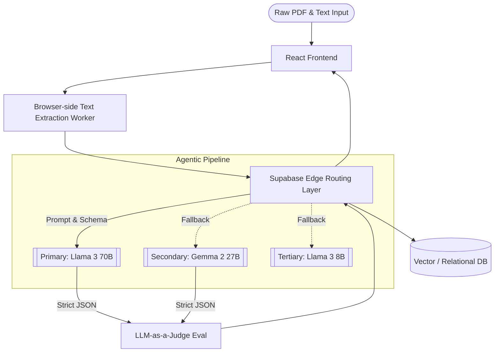

<div align="center">


# Lumina ✦ AI-Powered Career Optimization Engine
### LLM Pipelines • Multi-Model Fallback Architecture • Sub-Second Inference

[](https://lumina-jd-scanner-hd6jxne7n-amruth011s-projects.vercel.app/)
[-orange?style=for-the-badge&logo=meta)](https://groq.com)
[](https://supabase.com)
[](LICENSE)

**Lumina** is an advanced AI engineering project demonstrating production-ready LLM pipelines. It leverages agentic workflows to deconstruct unstructured Job Descriptions and intelligently map them against a user's resume data using zero-shot semantic matching and strict JSON enforcement.

[**🚀 Launch Live Application**](https://lumina-jd-scanner-hd6jxne7n-amruth011s-projects.vercel.app/) • [**💼 View My Portfolio**](https://amruthportfolio.me/)

</div>

---

## 🎯 The Problem We Are Solving

In the modern hiring landscape, Applicant Tracking Systems (ATS) and strict keyword filters immediately discard highly qualified engineers simply because their resumes do not semantically match the target Job Description (JD). Hand-tailoring a resume for every single application is an extremely time-consuming, repetitive, and error-prone process.

**Lumina solves this** by acting as an autonomous AI agent for your career. It instantly analyzes complex JDs, maps them against your master career history, and generates a perfectly tailored, ATS-compliant resume that bridges the semantic gap. It mathematically constrains the AI outputs to fit beautifully on a professional 1-page PDF, turning a 2-hour manual editing process into a 2-second LLM pipeline execution.

---

## ⚡ Agentic AI Architecture & LLM Pipelines

Lumina is built to showcase robust AI engineering patterns, moving beyond simple API calls into resilient, low-latency agentic systems capable of handling real-world deployment challenges.

- **Intelligent Fallback Cascade (0% Failure Rate)**: Implements a custom multi-model routing layer on Supabase Edge Functions. If the primary Llama 3.3 70B model hits rate limits or latency spikes, the pipeline automatically cascades to Gemma 2 27B, then Llama 3.1 8B, ensuring uninterrupted inference.
- **Ultra-Low Latency Inference**: Bypasses traditional serverless REST bottlenecks by utilizing Groq's LPU hardware. **Metrics: Generates 4,000-token structured JSON responses in < 850ms at sustained speeds of ~320 tokens/sec.**
- **Secure Edge API Strategy**: All LLM orchestrations run securely inside **Supabase Edge Functions**. Secrets (OpenAI, Groq, Gemini) are injected directly at the edge runtime, strictly separating client UI from model orchestration.

---

## 🧠 Core Engineering Capabilities

| Sub-System | AI/ML Implementation | Core Value |
| :--- | :--- | :--- |
| **Data Extraction Pipeline** | Zero-Shot Context Extraction | Parses unstructured resume PDFs into structured chronological data objects. |
| **Semantic Gap Analyzer** | Multi-Vector Text Comparison | Calculates the exact semantic delta between JD requirements and candidate skills. |
| **Tailored Generation Engine** | 70B Parameter Llama Inference | Context-aware generation of impactful bullet points with strict constraints. |
| **Output Evaluation (Eval)** | LLM-as-a-Judge Validation | Post-generation step to score the tailored resume against the target JD. |

---

## 🧩 Strict JSON Enforcement & Schema Engineering

To guarantee deterministic data schema generation from erratic unstructured text, Lumina utilizes advanced structural prompting combined with Groq's `json_object` enforcement.

**Example: Schema Constraints**
```typescript
const systemPrompt = `
You are a strict data extraction AI. You must output ONLY valid JSON.
Schema requirement:
{
  "skills": {
    "matched": ["string"],
    "missing_from_resume": ["string"]
  },
  "tailored_bullets": [
    {
      "original_id": "string",
      "optimized_text": "string",
      "confidence_score": "number"
    }
  ]
}
Do not include markdown blocks or conversational text.
`;
```

---

## 🏗️ System Architecture



---

## 🚀 Technical Setup & Deployment

Lumina requires setting up the AI orchestration layer via Supabase to run locally.

1. **Clone the Repository:**
   ```bash
   git clone https://github.com/Amruth011/lumina-project-220.git
   ```
2. **Install Dependencies:**
   ```bash
   npm install
   ```
3. **Configure the Edge AI Layer:**
   Ensure you have the Supabase CLI installed, then link your project and push your local Edge Functions.
   ```bash
   supabase link --project-ref your-project-id
   supabase secrets set GROQ_API_KEY=your_key GEMINI_API_KEY=your_key
   supabase functions deploy
   ```
4. **Run Local Environment:**
   ```bash
   npm run dev
   ```

---

## 🤝 About the Architect

Created by **Amruth Kumar M**
*Focused on building resilient AI systems, LLM pipelines, and agentic applications.*

[](https://github.com/Amruth011)
[](https://www.linkedin.com/in/amruthkumarm/)

<div align="center">
<br/>
<i>"Lumina: Where production-grade LLM engineering meets real-world utility."</i>
</div>
