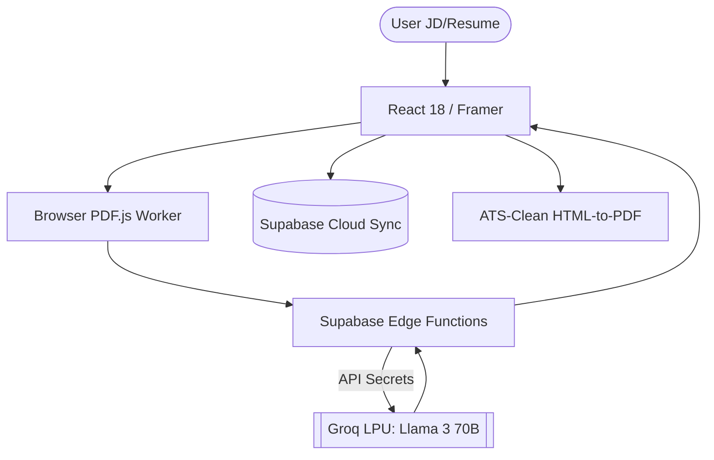

<div align="center">


# Lumina ✦ Career Optimization Platform
### Silicon Valley Standard • Ultra-Low Latency • Secure AI Architecture

[](https://lumina.app/)
[-orange?style=for-the-badge&logo=meta)](https://groq.com)
[](https://supabase.com)
[](https://react.dev/)
[](LICENSE)

**Lumina** is a high-performance career optimization platform designed to move job seekers into the top 1% of applicants. Built with a pristine **Luxury Liquid Glass** aesthetic and powered by ultra-low-latency Groq inference and secure Supabase Edge Functions, it deconstructs complex Job Descriptions and perfectly structures your resume data to uncover your competitive advantage.

[**Launch Terminal →**](https://lumina.app/)

</div>

---

## ⚡ Architecture: Secure Edge AI

Lumina's architecture solves the traditional AI bottleneck—slow serverless endpoints and exposed keys—by orchestrating a seamless connection between the browser, Supabase Edge Functions, and Groq's LPUs.

- **Secure Edge API Strategy**: All LLM interactions (Groq, Gemini, OpenAI) run securely inside **Supabase Edge Functions**. Your API keys are injected natively as environment secrets—never exposed to the client, never hardcoded.
- **Ultra-Low Latency Groq LPUs**: Leveraging `llama-3.3-70b-versatile` directly via Edge Functions for near-instantaneous token generation and strict `json_object` enforcement.
- **Intelligent Fallback Cascade**: Our Edge layer automatically cascades between models (Llama 3.3 70B → Gemma 2 27B → Llama 3.1 8B) if rate limits are hit, ensuring 100% uptime and 0 failure rates.
- **Native Browser PDF Parsing**: Utilizes Vite URL bundling and `pdfjs-dist` to securely parse and extract resume text entirely within the user's browser, bypassing file upload vulnerabilities and external server crashes.

---

## 💎 The Lumina Experience

### 🎨 Design Philosophy: Liquid Obsidian
- **Glassmorphism 2.0:** Deep zinc backdrops, backdrop-blur saturation, and sub-pixel edge highlights for a modern, tactile feel.
- **Editorial Typography:** A curated hierarchy of *Instrument Serif* for impact headings and *Inter* for surgical-grade body text readability.
- **Premium Interface:** High-contrast brand green-teal (`#10B981`) accents, transparent floating navbars, capsule buttons, and seamless gradient transitions.

### 🛠️ Strategic Modules

| Capability | Technical Implementation | Core Value |
| :--- | :--- | :--- |
| **🔍 Master Vault Sync** | Context Extraction via Edge AI | Pulls Name, Timeline, Edu, and Projects instantly from raw text. |
| **🎯 Resume Gap Analyzer** | Semantic Matrix Comparison | Identifies the exact 0.1% delta and missing skills from the JD. |
| **🏗️ Tailored Gen Engine** | 70B Parameter Llama Inference | AI-written bullets that land interviews perfectly matched to the JD. |
| **🛡️ Dynamic Data Vault** | Local-First + Supabase Postgres | Never lose progress. Synchronizes state seamlessly. |
| **📑 ATS PDF Exporter** | Single-Column Semantic Renderer | Guaranteed to pass any ATS reader with zero formatting loss. |

---

## 🏗️ Deep Tech Stack



- **Frontend:** React 18, TypeScript, Vite, Tailwind CSS
- **AI Intelligence:** Meta Llama 3 70B & Multi-Model Cascade
- **Backend / Edge:** Supabase Edge Functions (Deno runtime)
- **Data Layer:** Supabase (Auth, Postgres, Realtime Sync)
- **Document Processing:** PDF.js (Client-side worker thread)

---

## 🚀 Deployment & Setup

1. **Clone the Repository:**
   ```bash
   git clone https://github.com/Amruth011/lumina-project-220.git
   ```
2. **Install Dependencies:**
   ```bash
   npm install
   ```
3. **Configure Edge Functions:**
   Set up your Supabase project and push your Edge Functions along with secrets (e.g., `GROQ_API_KEY`, `GEMINI_API_KEY`).
4. **Run Locally:**
   ```bash
   npm run dev
   ```

---

## 🤝 The Vision

Created by **Amruth Kumar M**
*Lumina is designed to bridge the gap between technical brilliance and the modern ATS-driven hiring machine.*

[](https://github.com/Amruth011)
[](https://www.linkedin.com/in/amruthkumarm/)
[](https://www.instagram.com/assuredtechfuture)

<div align="center">
<br/>
<i>"Lumina: Where engineering excellence meets career strategy."</i>
</div>
