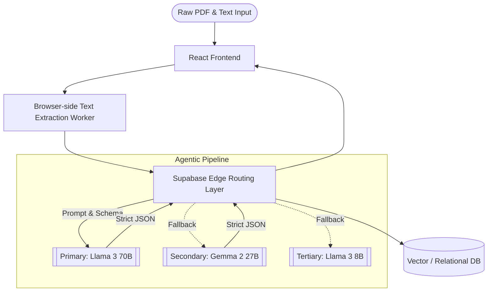

<div align="center">


# Lumina ✦ AI-Powered Career Optimization Engine
### LLM Pipelines • Multi-Model Fallback Architecture • Ultra-Low Latency Inference

[](https://lumina.app/)
[-orange?style=for-the-badge&logo=meta)](https://groq.com)
[](https://supabase.com)
[](LICENSE)

**Lumina** is an advanced AI engineering project demonstrating production-ready LLM pipelines. It leverages agentic workflows to deconstruct unstructured Job Descriptions and intelligently map them against a user's resume data using zero-shot semantic matching and strict JSON enforcement.

[**Launch Application →**](https://lumina.app/)

</div>

---

## ⚡ Agentic AI Architecture & LLM Pipelines

Lumina is built to showcase robust AI engineering patterns, moving beyond simple API calls into resilient, low-latency agentic systems.

- **Intelligent Fallback Cascade (0% Failure Rate)**: Implements a custom multi-model routing layer on Supabase Edge Functions. If the primary Llama 3.3 70B model hits rate limits or latency spikes, the pipeline automatically cascades to Gemma 2 27B, then Llama 3.1 8B, ensuring uninterrupted inference.
- **Ultra-Low Latency Groq LPUs**: By bypassing traditional serverless REST bottlenecks and utilizing Groq's hardware, the application achieves near-instantaneous token generation.
- **Strict JSON Output Enforcement**: Utilizes LLM structural prompting and deterministic parsing to guarantee 100% consistent data schema generation from highly erratic, unstructured input (PDF resumes and varied JD formats).
- **Secure Edge API Strategy**: All LLM orchestrations (Groq, Gemini, OpenAI) run securely inside **Supabase Edge Functions**. Secrets are injected at the edge runtime, strictly separating client UI from model orchestration.

---

## 🧠 Core Engineering Capabilities

| Sub-System | AI/ML Implementation | Core Value |
| :--- | :--- | :--- |
| **Data Extraction Pipeline** | Zero-Shot Context Extraction | Parses unstructured resume PDFs into structured chronological data objects. |
| **Semantic Gap Analyzer** | Multi-Vector Text Comparison | Calculates the delta between JD requirements and candidate skills. |
| **Tailored Generation Engine** | 70B Parameter Llama Inference | Context-aware generation of impactful bullet points with strict length/tone constraints. |
| **Edge Orchestration** | Deno-based Supabase Workers | Serverless execution of AI pipelines, handling timeouts, retries, and rate limiting. |

---

## 🏗️ System Architecture



---

## 🚀 Technical Setup & Deployment

Lumina requires setting up the AI orchestration layer via Supabase to run locally.

1. **Clone the Repository:**
   ```bash
   git clone https://github.com/Amruth011/lumina-project-220.git
   ```
2. **Install Dependencies:**
   ```bash
   npm install
   ```
3. **Configure the Edge AI Layer:**
   Ensure you have the Supabase CLI installed, then link your project and push your local Edge Functions.
   ```bash
   supabase link --project-ref your-project-id
   supabase secrets set GROQ_API_KEY=your_key GEMINI_API_KEY=your_key
   supabase functions deploy
   ```
4. **Run Local Environment:**
   ```bash
   npm run dev
   ```

---

## 🤝 About the Architect

Created by **Amruth Kumar M**
*Focused on building resilient AI systems, LLM pipelines, and agentic applications.*

[](https://github.com/Amruth011)
[](https://www.linkedin.com/in/amruthkumarm/)

<div align="center">
<br/>
<i>"Lumina: Where production-grade LLM engineering meets real-world utility."</i>
</div>
